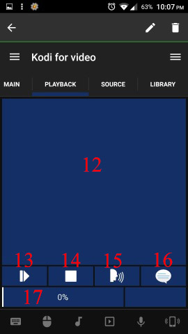

# Kodi For Video
This remote aim to control [Kodi](http://kodi.tv/).  
I'm inspire from [Yatse](https://play.google.com/store/apps/details?id=org.leetzone.android.yatsewidgetfree) another Android application. 

## Features
All features are numbered and shown on the screenshots below.

1. Display status (Not Connected, Not playing, Connecting, Title of current movie)
2. Go to home
3. Display context menu
4. Display movie information
5. Display a popup menu wich allow to Exit, Shutdown, Suspend, Hibernate, Reboot
6. Control sound level of Kodi
7. Navigate in every menu of Kodi
8. Select the current menu or video
9. Return to previous menu
10. Control windows menu with media button in the bottom of the screen. It's the music sound icon.
11. Launch Kodi from remote
12. I've try to display thumbnail or FanArt but it's too slow. Currently I don't know how to retrieve thumbnail from Kodi. I can just receive image from url.
13. Play/Pause
14. Stop
15. Choose a audio language
16. Choose a subtitle or none
17. Seek bar which show the progression of watching. I would like to pick a time for seeking inside movie but the widget does not exists currently.
18. List all available sources. !!! **The selelection of a source works only in List view !!!**
19. Clean Kodi DB
20. Refresh Kodi DB with new movie. It will grap information and thumbnails from specific web site like [https://www.themoviedb.org](https://www.themoviedb.org)
21. It's the default screen from official Kodi Web Advance remote. So, it's not mine     

## Screenshots

 

## Requirements
* A installation of [Kodi](http://kodi.tv/)

## Setup
### Kodi Setup
After installing it you must configure Kodi for being controlled by Unified Remote.

1. Launch Kodi.  
2. Go to `System` → `Service` → `Web Server`.
3. Check `Allow control of Kodi via HTTP`.
4. You can change the Port number. But it's important to configure the remote command with the same port.

### Remote Setup
Inside the folder "KodiForVideo", there is a file `settings.prop`. You can configure the following parameters (all values are default):

- host: localhost
- kodiPath: `%programfiles(x86)%\\Kodi\\Kodi.exe`
- pathForThumbnail: nothing (*currently disable because of perf problem*)
- playerId: none (*information retrieve from Kodi*)
- port: **80**
- status: stop (*this is a variable for the remote command)*
- trace: 0 (*disable/enable tracing*)   